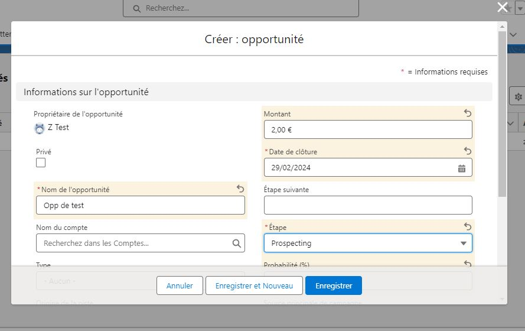
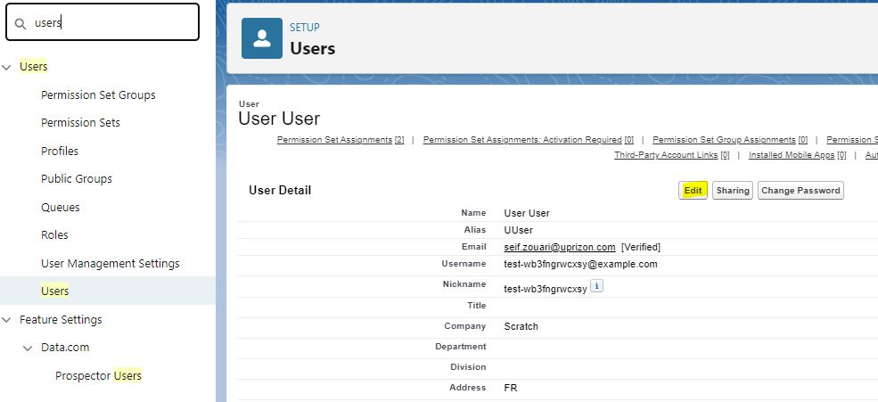

# The steps to trigger approval processes

   - The user (Z Test) creates a new opportunity.

   - In the layout of the new opportunity created by the user, there is a 'Submit for Approval' button that will appear. This is determined by a condition in the approval process configuration, which indicates that if the opportunity stage is 'Prospecting', the button will be displayed.

   - There is an area to enter a comment for the manager or approver.

   - The manager or approver receives a notification on their profile and also by email.

   - This interface for the approval request intended for the manager or approver contains details as well as a comment section. Additionally, it provides 3 buttons: Approve, Reject, and Reassign, to take action.
  

   - If a user wants to modify a value after submitting for approval, they will not be able to do so because the process locks it and they will not find the 'Submit for Approval' button.  

   - In the opportunity layout, a new section titled 'Approval History' is displayed in the related list.

   - **For your information:** After approval, the user is not allowed to modify a value. To unblock the user and allow them to modify a value, their manager must reject their request.

## Disable standard email notifications for the Approval Process

## 1. Step: 
in setup search for the User in search.
## 2. Step: 
Once selected the user in the user list, need to click edit.

## 3. Step: 
Under the ‘Receive Approval Request Emails’ field, select “Never” in the picklist.

## 4. Step: 
Finally we can save. Now salesforce will not send approval process notification.

