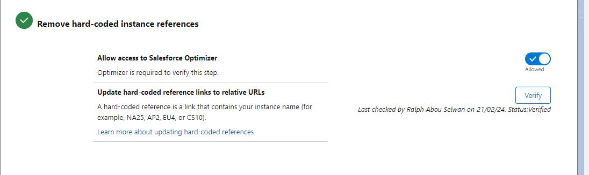

# Hyperforce Salesforce

The migration to Hyperforce Salesforce represents a significant step for Salesforce customers, promising an enhanced cloud infrastructure offering improved security, scalability, and regional compliance. Here is a summary of key information, potential impacts, and recommended actions to prepare your Salesforce instance for this migration.

## **Advantages of Hyperforce**

   - Scalability: Hyperforce allows unlimited growth for your business.

   - Security and Privacy: Data is encrypted both at rest and in transit, ensuring enhanced security.

   - Flexibility: Operates across global public clouds, enabling better management of data residency.

https://www.grazitti.com/blog/elevate-your-digital-endeavors-with-salesforce-hyperforce/.

## **Impacts and Preparations**

1. Migration of Production Instance Only:

   - Only production instances are migrated to Hyperforce. If you have sandbox instances, you will need to recreate or refresh them after the migration.

2. Read-Only Access:

   - During the migration, your Salesforce organization will be in read-only mode. It is advised to pause all Salesforce integrations during this period.

3. Update URLs and IP Ranges:

   - It is essential to remove any hardcoded instance references in your code and update the allowed IP ranges to accommodate the new Hyperforce cloud ranges.

4. Use of My Domain:

   - Activating My Domain in your organization is crucial for the migration. This helps to avoid hardcoded references and facilitates API integrations.

5. Impact Analysis:

   - Before the migration, assess how it will affect your organization. Use Hyperforce Assistant for this analysis.

6. Technical Preparation:

   - Use the Hyperforce Assistant to guide you throughout the migration. This includes removing hardcoded instance references and updating IP whitelist.

## **Business Advantages of Hyperforce**

- Data Localization Choice:
   - Hyperforce allows you to choose where your data is stored, making compliance with local regulations easier.
- Enhanced Security:
   - With advanced features such as data encryption, your information is more secure.
- Improved Performance:
   - Hyperforce optimizes performance, allowing developers to work more efficiently.

## **In summary**

Migration to Hyperforce requires careful preparation, including updating hardcoded URLs, managing IP ranges, and using My Domain. The benefits of Hyperforce, such as improved security, geographical flexibility, and performance optimization, make this transition advantageous for Salesforce customers. To ensure a successful migration, become familiar with the tools and resources provided by Salesforce, such as Hyperforce Assistant, and plan accordingly to minimize impact on your daily operations.

## **Manual Actions to Take:**

- Prepare the production org to check for any elements that need modification in the organization. The verification process sends a report at each step if there are any issues in the organization.
- Remove all hardcoded code in Salesforce (URLs, tokens, IP addresses, etc.).
- Stop all batch jobs during the migration.

## 1. Step:

Translate to English: "In the quick find, search for the term 'Hyperforce Assistant'.

## 2. Step:

## 3. Step:

Click on "Not Allowed" to change to "Allowed".
Click on the "Verify" button.

## 4. Step:

Click on the "Verify" button.

## 5. Step:

Click on the "Verify" button.

## 6. Step:

Click on "Complete".
Click on the "Verify" button.

## 7. Step:

Click on "Complete".
Click on the "Verify" button.

## 8. Step:

Click on "Complete".
Click on the "Verify" button.

Otherwise, in case of issues during verification, you can click on the 'Get Help' button.

If everything goes well, you will receive an email confirming the status: Verified.

In the quick find, search for the term 'Optimizer'.

Click on the 'Open Optimizer' button.

Click on the 'Run Optimizer' button.

You will receive an email "Your Salesforce Optimization results are ready."

In our sandbox, there are 5 features to fix:

These items are not blockers for the migration.

