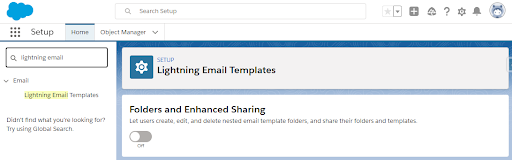
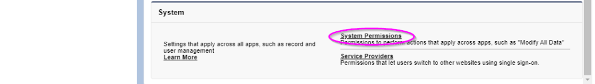
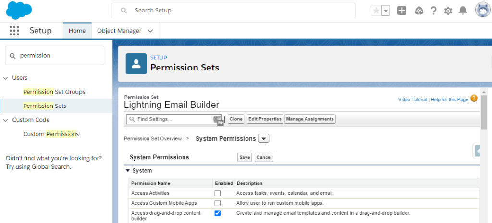
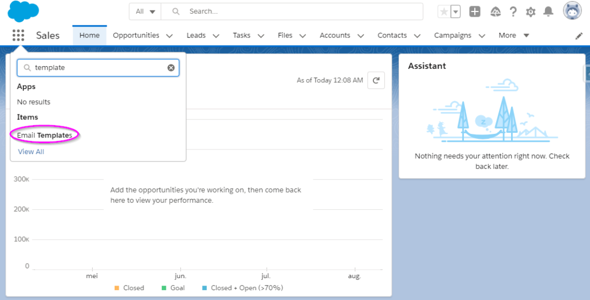
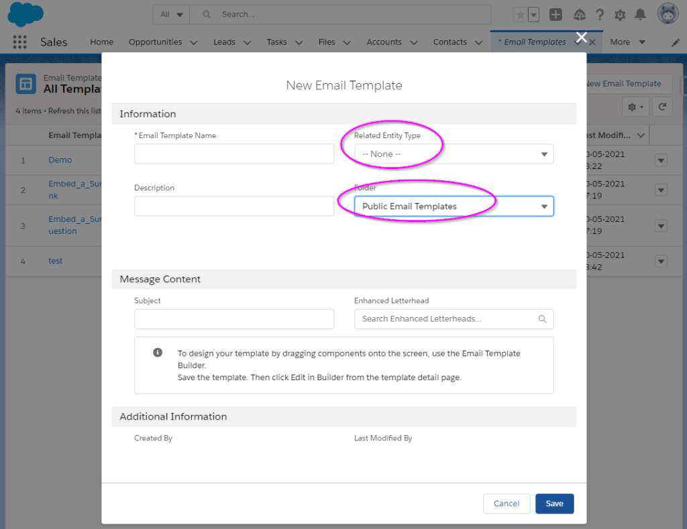
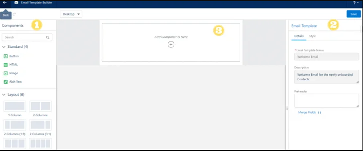

# How to Enable Lightning Email Templates

## 1. **Part 1:Enable Template Folder Sharing**

   - While this aspect isn't obligatory, It proves highly beneficial for all users as it facilitates the sharing and access of email templates among them.

1. Go to **Setup** and search for **Lightning Email Templates**.

2. Switch on **Folders and Enhanced Sharing** (see the screenshot below).

## 1. **Part 2:Part 2: Enable Content Builder**

1. Create a new **Permission Set** (e.g. “Lightning Email” permission set).

2. Go to **System Permissions**.

3. Tick **Access drag-and-drop content builder** (this controls whether the Edit in Builder button appears later on).
4. Tick **Manage Public Lightning Email Templates**.
5. **Save**.
6. Apply to **users** as appropriate.

7. **Wait 15 minutes**, Alternatively, You can log out and log back in to prevent any potential delays associated with Lightning. This step is recommended to ensure a smooth experience. If you find that the Edit in Builder button is not visible while using the Template Builder in the following section, It indicates that your system has not yet received the necessary updates.

# Create Email Templates in Salesforce Lightning

1. Navigate to the App Launcher icon (the collection of nine dots positioned at the top left-hand corner) and locate the Templates option within the app menu. Surprisingly, Although it seems to have been available for some time, This is my initial encounter with it!

2. Begin by crafting a **new template** where you'll input the 'metadata' for the email. This includes details such as the subject line, The related object (if you wish to merge field data into it), and the designated location for saving it. The body of the email will be added shortly, But for now, Focus on these initial details.

3. Proceed to the next screen where you will find the Edit in Builder button. Click on it to continue with the editing process.

# Configuring Lightning Email Templates:

   - Clicking on the Edit in Builder button will redirect you to the Email Template Builder interface.

1. The Email Template Builder encompasses various attributes that you can leverage in crafting your custom email templates. Additionally, it offers six standard template layouts accessible via the Layout drop-down menu.

2. Within this interface, you can furnish details for your email template such as its name, description, and more. The Style panel enables you to modify both the body of your email template and its background color.

3. This central canvas serves as the primary workspace where you can configure all elements of your email template.
